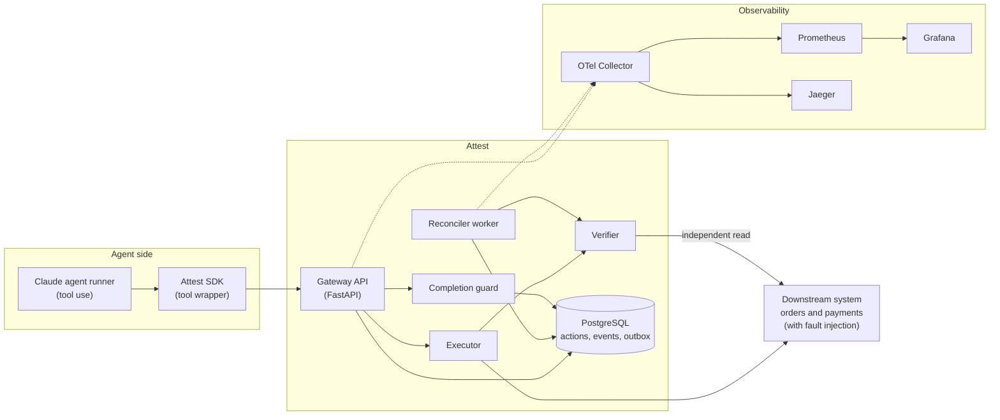
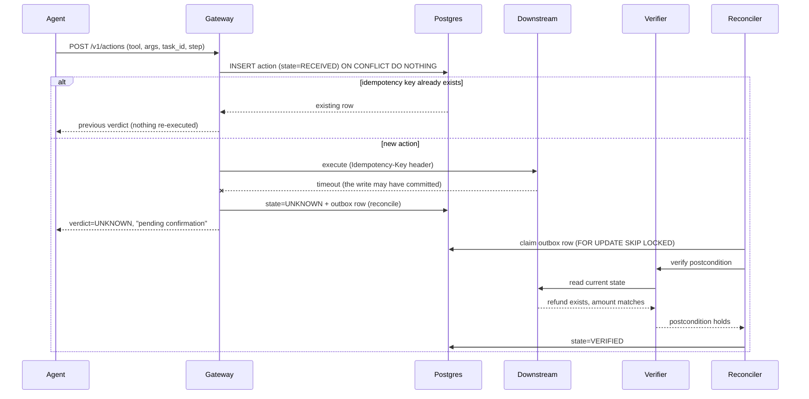
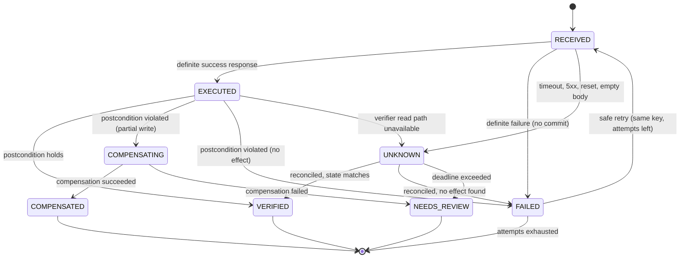

# Attest: Verified Actions for AI Agents

> A reliability layer that stops AI agents from saying "done" when nothing happened, and from doing things twice when they retry.

**Author:** Anshul Bhaskar · **Date:** 2026-09-19 · **Scope:** weekend vertical slice · **Status:** design approved

---

## 1. TL;DR

- **Problem.** Production AI agents increasingly *act* (issue refunds, cancel orders, update records). When a tool call times out, returns an empty 200, or half-applies, the agent often reports success anyway, or retries and duplicates the side effect. Nobody notices until the damage accumulates, because monitoring watches the conversation, not the system state.
- **Solution.** Attest sits between the agent and every side-effecting tool. Each action has a contract (idempotency key, postcondition, compensation). Attest **verifies the outcome against real system state** and returns one of three verdicts: `VERIFIED`, `FAILED`, or `UNKNOWN`. Ambiguous outcomes are resolved by a reconciler, never by blind retry. A completion guard rejects any "done" claim that is not backed by verified actions.
- **Proof.** A benchmark compares three setups under injected faults and reports false-success rate, duplicate side effects, task completion, and added latency.
- **Stack.** Python 3.12, FastAPI, Pydantic v2, PostgreSQL 16, OpenTelemetry, Prometheus, Grafana, Jaeger, Docker Compose, GitHub Actions, pytest and Hypothesis.

---

## 2. Problem statement

### 2.1 What is failing in production

| Failure pattern | Evidence | Why it matters |
|---|---|---|
| **False success**: the agent claims completion while system state disagrees | A 2026 study of 9,876 trajectories from 8 frontier model families found false success made up 44-52% of failures in single-control customer-service domains, and 75.8% of failures on AppWorld among architectures that emit explicit completion signals. Reasoning models were not immune. | It propagates silently. Unlike a crash or a refusal, the interaction looks resolved. |
| **Quiet tool failures** | Tool-calling fails roughly 3-15% of the time in production. The most damaging cases are silent: HTTP 200 with an empty payload. | Tool calls are external actions with side effects, not pure functions. |
| **Capacity-driven ambiguity** | Datadog's State of AI Engineering 2026 report: about 5% of production LLM requests fail, and nearly 60% of those failures are capacity limits (rate limits, timeouts). | Timeouts and retries are exactly what create "did it happen or not?" situations. This is an inference from the data, not a claim the report makes. |
| **Compounding** | 85% reliability per step gives about 20% end-to-end success on a 10-step workflow (0.85^10 = 0.197). | Multi-step agents amplify every small failure rate. |
| **Errors that never reach a human** | One longitudinal study of a production agent runtime documented 22 incidents in eight weeks; the meta-pattern of an error signal never reaching a human in actionable form appeared at least 28 times. | Even well-tested systems fail silently. |
| **Liability** | *Moffatt v. Air Canada* (2024 BCCRT 149): a tribunal held the airline responsible for what its chatbot told a customer. | Companies own what their agents say and do. |

### 2.2 Why the usual fixes fall short

| Common fix | What it does | The gap |
|---|---|---|
| Retries with backoff | Recovers from transient errors | Retrying an ambiguous call can duplicate the side effect |
| Idempotency keys alone | Prevents duplicate execution | Says nothing about whether the effect actually happened; misses silent no-ops and partial writes |
| Guardrails and text evals | Check the agent's *words* | The words can be perfectly fluent and wrong |
| Tracing and observability | Show what the agent did | They show the agent's *claim*, not the ground truth |
| Human review of everything | Catches errors | Does not scale, and defeats the point of automation |

**The gap Attest closes:** nothing in the typical stack compares *what the agent says happened* with *what actually happened in the system of record*.

---

## 3. Solution overview

Attest borrows patterns from payments engineering, where "did the charge go through?" has always been a first-class question.

1. **Action contracts.** Every side-effecting tool is declared in YAML: how to call it, which outcomes are definite vs ambiguous, how to verify it, how to undo it.
2. **Ledger and idempotency.** Every action is written to a Postgres ledger *before* execution. A deterministic idempotency key (from task, step, tool, and arguments) makes re-submission a lookup, not a re-execution. The key is also forwarded downstream.
3. **Verify against state, not the response.** After execution, the verifier evaluates the contract's postcondition through an independent read path.
4. **Three-valued verdicts.** `VERIFIED`, `FAILED`, `UNKNOWN`. Timeouts, 5xx errors, resets, and empty bodies are `UNKNOWN`. Only a reconciler resolves them, by reading real state. Retry happens only after confirming no effect.
5. **Completion guard.** The agent's final answer must be structured and cite action IDs. Attest rejects "completed" if any cited action is not `VERIFIED`, or if a required action for the task is missing.

**Delivery semantics.** Attest does not claim exactly-once. It provides at-least-once delivery with idempotent effects plus verification, which gives an *effectively-once outcome that is checked*.

---

## 4. Goals, non-goals, success criteria

**Goals**
- Eliminate false success caused by ambiguous, silent, or partial tool outcomes.
- Eliminate duplicate side effects caused by retries and duplicate delivery.
- Make the claimed-versus-verified gap a first-class metric.
- Show a reproducible benchmark with confidence intervals.

**Non-goals (deliberately out of scope for the weekend slice):** multi-tenancy, UI, authentication and authorization, multi-agent orchestration, verifying the verifier's own read path, and LLM-judged quality of the agent's prose.

**Success targets (to be validated by the benchmark, not assumed):**
- Attest arm: zero duplicate side effects under the `duplicate_delivery` profile.
- Attest arm: false-success rate near zero across all fault profiles.
- Verification overhead: p95 added latency under 150 ms per action on the local Docker setup.
- Every `UNKNOWN` action resolves to `VERIFIED`, `FAILED`, or `NEEDS_REVIEW` within its deadline.

---

## 5. Architecture

### 5.1 Component view



### 5.2 Sequence: an action that times out after the downstream commit



### 5.3 Action state machine



A retry is only ever allowed from `FAILED`, and an action reaches `FAILED` only when the system has *confirmed* no effect. That is the core safety property.

### 5.4 Components

| Component | Responsibility | Depends on | Interface |
|---|---|---|---|
| **Agent runner** | Runs a Claude tool-use loop for support tasks (refunds, cancellations, address changes) | Attest SDK, LLM API | CLI and Python API |
| **Attest SDK** | Wraps tool functions, derives idempotency keys, calls the gateway, formats verdicts for the model | Gateway | Python decorator |
| **Gateway** | Validates requests, writes the ledger, enforces idempotency and resource fencing, serves verdicts | Postgres, Executor | REST |
| **Executor** | Calls the downstream system with timeouts, classifies the response (definite vs ambiguous) per contract | Contracts, Downstream | Internal |
| **Verifier** | Evaluates postconditions via an independent read path using a sandboxed expression evaluator (no `eval`) | Contracts, Downstream (read) | Internal |
| **Reconciler** | Claims outbox rows, verifies, resolves `UNKNOWN`, runs compensation, sweeps stuck `RECEIVED` rows | Postgres, Verifier | Worker process |
| **Completion guard** | Validates the agent's final structured answer against the ledger | Postgres | REST |
| **Downstream mock** | Orders and payments service with a seeded chaos layer | none | REST |
| **Benchmark harness** | Runs scenarios across arms and fault profiles, computes metrics from ground-truth DB state | all | CLI |

---

## 6. Data model

```sql
CREATE TABLE actions (
    id              UUID PRIMARY KEY,
    idempotency_key TEXT        NOT NULL UNIQUE,
    task_id         TEXT        NOT NULL,
    step            INT         NOT NULL,
    tool            TEXT        NOT NULL,
    resource_key    TEXT        NOT NULL,          -- e.g. the order id, used for fencing
    args            JSONB       NOT NULL,
    state           TEXT        NOT NULL,          -- see state machine
    attempts        INT         NOT NULL DEFAULT 0,
    downstream_ref  TEXT,
    lease_until     TIMESTAMPTZ,                   -- for recovering crashed executions
    deadline_at     TIMESTAMPTZ,                   -- reconciliation deadline
    created_at      TIMESTAMPTZ NOT NULL DEFAULT now(),
    updated_at      TIMESTAMPTZ NOT NULL DEFAULT now()
);
CREATE INDEX actions_resource_idx ON actions (resource_key, state);

CREATE TABLE action_events (                       -- append-only audit trail
    id          BIGSERIAL PRIMARY KEY,
    action_id   UUID        NOT NULL REFERENCES actions(id),
    from_state  TEXT,
    to_state    TEXT        NOT NULL,
    detail      JSONB,
    at          TIMESTAMPTZ NOT NULL DEFAULT now()
);

CREATE TABLE outbox (
    id          BIGSERIAL PRIMARY KEY,
    action_id   UUID        NOT NULL REFERENCES actions(id),
    kind        TEXT        NOT NULL,              -- 'reconcile' | 'compensate'
    run_after   TIMESTAMPTZ NOT NULL DEFAULT now(),
    attempts    INT         NOT NULL DEFAULT 0,
    done_at     TIMESTAMPTZ
);
```

**Idempotency key:** `sha256(task_id | step | tool | canonical_json(args))`.

**State transitions and outbox writes happen in the same transaction**, so the ledger and the work queue can never disagree.

---

## 7. Action contracts and API

### 7.1 Example contract

```yaml
name: issue_refund
resource_key: "{args.order_id}"
downstream:
  method: POST
  path: /refunds
  idempotency_header: Idempotency-Key
  timeout_ms: 2000
  definite_failure_statuses: [400, 402, 404, 409, 422]   # known no-commit
  # Everything else is ambiguous: timeout, connection reset, 5xx, empty body.
postcondition:
  read: GET /orders/{args.order_id}
  assert:
    - "body.refund.status == 'processed'"
    - "body.refund.amount == args.amount"
    - "body.refund.count == 1"        # also catches duplicate refunds
compensation:
  method: POST
  path: /refunds/{downstream_ref}/reverse
reconcile:
  backoff_seconds: [1, 2, 4, 8, 16]
  deadline_seconds: 60
```

**Note:** 5xx responses are treated as *ambiguous*, not failed, because a server can commit and then fail while responding.

**Resource fencing:** while an action on a `resource_key` is `UNKNOWN` or `COMPENSATING`, the gateway refuses new actions on that resource with `409 resource_busy`. This prevents an agent from "fixing" an ambiguous refund by issuing a different one.

### 7.2 API surface

| Endpoint | Purpose |
|---|---|
| `POST /v1/actions` | Submit an action. Returns `{action_id, state, verdict, message}` |
| `GET /v1/actions/{id}` | Current state and audit trail |
| `POST /v1/tasks/{task_id}/finalize` | Completion guard. Body: `{outcome, action_ids}`. Returns `{accepted, reasons[]}` |
| `GET /metrics` | Prometheus metrics |

**Completion guard rules:** `outcome=completed` is accepted only if every cited action is `VERIFIED` and every action the task template lists as required is cited. `outcome=pending` and `outcome=failed` are always accepted, because honesty is never blocked.

---

## 8. Failure handling (fail closed)

| Situation | Detection | Behavior | Agent sees |
|---|---|---|---|
| Downstream 4xx validation error | Status in `definite_failure_statuses` | `FAILED`; safe retry with the same key if attempts remain | `FAILED` with reason |
| Timeout, reset, 5xx, or empty body | Executor classification | `UNKNOWN` + outbox row | "pending confirmation" |
| 2xx but postcondition violated, no effect | Verifier | `FAILED` | `FAILED` |
| 2xx but partial write | Verifier | `COMPENSATING`, then `COMPENSATED` | `FAILED`, effect rolled back |
| Verifier read path unavailable | Verifier error | Stays `UNKNOWN`; never assumed verified | "pending confirmation" |
| Reconciliation deadline exceeded | Reconciler | `NEEDS_REVIEW` + alert | "pending, escalated" |
| Compensation fails | Reconciler | `NEEDS_REVIEW` + alert | "pending, escalated" |
| Gateway crashes after calling downstream | Reconciler sweeps `RECEIVED` rows past `lease_until` | Moved to `UNKNOWN`, then reconciled | "pending confirmation" |
| Two concurrent identical calls | `UNIQUE(idempotency_key)` | Second caller receives the first row's state | Same verdict, no duplicate |
| Postgres unavailable | Connection error | Gateway returns 503 *before* executing anything, so nothing runs unlogged | Retryable error |
| Agent ignores a verdict and claims done | Completion guard | `finalize` rejected | Rejection with reasons |

---

## 9. Observability

**Traces (OpenTelemetry).** One trace per task. Spans for each LLM call (using the GenAI semantic conventions), each Attest action, each verification, and each reconciliation attempt. Attributes: `attest.action_id`, `attest.tool`, `attest.state`, `attest.verdict`.

**Metrics (Prometheus).**
- `attest_actions_total{tool, verdict}`
- `attest_claim_verified_gap`: fraction of actions the downstream *claimed* successful that failed verification. The headline metric.
- `attest_unknown_age_seconds` (histogram) and `attest_unknown_open` (gauge)
- `attest_reconcile_attempts_total`
- `attest_duplicates_prevented_total`
- `attest_guard_rejections_total`
- `attest_verify_latency_seconds` (histogram)

**Grafana dashboard.** Four panels: claimed vs verified over time, open `UNKNOWN` actions and their age, duplicates prevented, and p50/p95 verification latency.

**Alerts.** `NEEDS_REVIEW` count greater than zero; `UNKNOWN` age above the reconciliation deadline.

---

## 10. Tech stack

| Layer | Choice | Why | Production evolution |
|---|---|---|---|
| Language and API | Python 3.12, FastAPI, Pydantic v2 | Fastest path to a working slice; strong typing for contracts | Go for the gateway hot path if needed |
| Agent | Native tool-calling loop | Same |
| Datastore | PostgreSQL 16 | Ledger, idempotency (unique key), audit log, and outbox in one transactional store | Partition by tenant or resource key; read replicas for verification with read-your-writes handling |
| Durable work | Outbox pattern with `SELECT ... FOR UPDATE SKIP LOCKED` | Simple, transactional, no extra infrastructure | Temporal for long-running workflows and sagas |
| Verification source | Direct read of downstream state | Independent of the tool response | CDC stream (for example Debezium into Kafka) instead of polling |
| Observability | OpenTelemetry, Prometheus, Grafana, Jaeger | Vendor-neutral standards | Managed backends |
| Contracts | YAML validated by Pydantic | Declarative and reviewable | Policy-as-code (for example OPA) for who may run which action |
| Packaging and CI | Docker Compose, GitHub Actions, Makefile | One-command demo and reproducible tests | Kubernetes and Helm |
| Testing | pytest, Hypothesis | Property tests for the state machine | Add Toxiproxy for network-level chaos |

---

## 11. Testing and benchmark

### 11.1 Test layers

- **Unit:** contract parsing, idempotency key derivation, the expression evaluator, classification of responses as definite vs ambiguous.
- **Property-based (Hypothesis):** random event sequences never produce an illegal state transition; a retry is only reachable from `FAILED`; terminal states never change.
- **Integration (Docker Compose):** real Postgres, the mock downstream, and a seeded fault schedule. Includes a crash test that kills the gateway between the downstream call and the ledger update.
- **CI:** runs the unit, property, and integration tiers with a stubbed LLM, so the pipeline has no API cost.

### 11.2 Fault profiles (seeded, configurable rate, default 30% of calls)

| Profile | What the downstream does |
|---|---|
| `none` | Behaves correctly |
| `timeout_after_commit` | Commits, then responds slower than the client timeout |
| `empty_200` | Returns 200 with an empty body; commits in about half of cases, so it is a silent no-op the rest of the time |
| `duplicate_delivery` | Delivers the same request twice (network retry or at-least-once queue) |
| `partial_write` | Applies only part of the side effect (for example, refund created but order status not updated) |

### 11.3 Arms

| Arm | Description |
|---|---|
| **A0: naive baseline** | Agent calls tools directly; standard retries with backoff on timeout and 5xx; trusts the tool response |
| **A1: idempotency only** *(stretch)* | A0 plus idempotency keys, but no verification, reconciliation, or guard |
| **A2: full Attest** | Everything in this document |

A1 exists to answer the obvious question, "isn't idempotency enough?", honestly.

### 11.4 Scenarios and runs

30 scenarios: 10 single-step refunds, 10 single-step cancellations, and 10 multi-step tasks (for example, cancel then refund) to show compounding. Each runs across 5 fault profiles with 3 seeds, which is 450 runs per arm. Run A0 and A2 first (900 runs); add A1 if budget allows. A `--max-runs` flag caps spend.

### 11.5 Method

- The agent outputs a structured `outcome` (`completed`, `pending`, or `failed`) in every arm, so no LLM judge is needed to extract claims.
- **Ground truth** comes from querying the downstream database directly after each run.
- Temperature 0; same model and prompts across arms except for the tool wrapper.
- Report proportions with Wilson 95% intervals, and latency at p50 and p95.

### 11.6 Metrics

| Metric | Definition |
|---|---|
| **False-success rate** | Runs where `outcome=completed` but ground truth disagrees |
| **Duplicate side-effect rate** | Runs where the same intent committed more than once |
| **Task completion rate** | Runs where ground truth satisfies the task |
| **Honest-pending rate** | Runs where the agent correctly reported `pending` while resolution was still outstanding |
| **Added latency** | Extra time per action versus A0 (p50 and p95) |

### 11.7 Results table (fill from your runs)

| Arm | False success | Duplicates | Completion | Honest pending | p95 added latency |
|---|---|---|---|---|---|
| A0 | | | | | n/a |
| A1 | | | | | |
| A2 | | | | | |

---

## 12. Repository layout

```text
attest/
├── docker-compose.yml
├── Makefile                  # make up | demo | test | bench | report
├── pyproject.toml
├── contracts/
│   ├── issue_refund.yaml
│   ├── cancel_order.yaml
│   └── update_shipping_address.yaml
├── migrations/               # Alembic
├── services/
│   ├── gateway/              # api, ledger, state_machine, executor, verifier, guard
│   ├── reconciler/           # worker, sweeper, compensation
│   ├── downstream_mock/      # orders and payments API + chaos layer
│   └── agent/                # runner, tools, prompts, SDK wrapper
├── bench/
│   ├── scenarios/            # 30 YAML scenarios
│   ├── runner.py
│   └── report.py             # tables, intervals, charts
├── observability/            # otel-collector.yaml, prometheus.yml, grafana dashboards
├── tests/
│   ├── unit/
│   ├── property/
│   └── integration/
└── docs/
    ├── architecture.md
    ├── benchmark.md
    └── blog.md
```

---

## 13. Weekend build plan

| Block | Deliverable |
|---|---|
| **Sat morning** | Repo skeleton, Docker Compose, Postgres schema and migrations, state machine with property tests |
| **Sat afternoon** | Gateway with ledger and idempotency; downstream mock with chaos layer; executor with response classification |
| **Sat evening** | Contracts, verifier with sandboxed assertions; end-to-end run of one action through all fault profiles |
| **Sun morning** | Reconciler with sweeper; completion guard; Claude agent runner and SDK wrapper |
| **Sun afternoon** | Benchmark harness and first full run; metrics endpoint; README with results |
| **Sun evening** | Grafana dashboard, blog numbers, demo GIF |

**Cut line if you fall behind:** drop compensation (`partial_write` becomes detect-and-flag), drop the A1 arm, and ship metrics without the Grafana dashboard. The must-haves are the ledger, idempotency, the verifier, the reconciler, the completion guard, and the A0 vs A2 benchmark.

---

## 14. Scaling path (what changes at production scale)

- **Tenancy and scale-out:** partition the ledger by tenant or `resource_key`; run stateless gateways behind a load balancer; scale reconciler workers horizontally (`SKIP LOCKED` already supports it).
- **Verification:** replace polling reads with a CDC stream (Debezium into Kafka) so verification is event-driven; handle read-replica lag with version tokens or verification against the primary.
- **Durable orchestration:** move multi-step tasks and compensation sagas onto Temporal.
- **Governance:** policy-as-code for which agent may run which action; human-approval steps for high-value actions.
- **Performance:** port the gateway hot path to Go if profiling justifies it.

---

## 15. Interview and resume positioning

### 15.1 Thirty-second pitch

"AI agents are starting to take real actions, and the failure I kept seeing in the research is that they report success when nothing happened, or retry and do it twice. I built a verification layer borrowed from payments engineering. Every action goes through a ledger with idempotency keys, the outcome is checked against the real system state, ambiguous results become an explicit UNKNOWN that a reconciler resolves, and the agent can't claim completion without verified actions. I benchmarked it under injected faults against a naive baseline."

### 15.2 Likely follow-up questions

| Question | Strong answer |
|---|---|
| Why not just use idempotency keys? | They prevent duplicates but don't tell you whether the effect happened, and they miss silent no-ops and partial writes. The A1 arm measures exactly this. |
| Is it exactly-once? | No. It is at-least-once delivery plus idempotent effects plus verification, which yields a checked, effectively-once outcome. |
| What if the verifier reads stale data? | Verify against the primary or use version tokens for read-your-writes; if it can't confirm, the action stays `UNKNOWN` (fail closed). At scale, use a CDC stream. |
| What if the LLM ignores the verdict? | The completion guard rejects unverified completion claims. |
| Why Postgres and not Kafka? | The ledger and outbox need one transactional boundary. Kafka enters later for CDC-based verification and fan-out. |
| What is the latency cost? | One extra read per action on the happy path; `UNKNOWN` resolution is asynchronous. The benchmark reports p50 and p95. |
| How does it scale? | Partition by tenant or resource key, stateless gateways, horizontally scaled reconcilers, Temporal for long-running sagas. |

### 15.3 Resume bullets (use only after you have run the benchmark; replace the bracketed values with your measured numbers)

- Designed and built **Attest**, a verification and reconciliation layer for AI agents that act on real systems (Python, FastAPI, PostgreSQL, OpenTelemetry), using idempotent ledgers, three-valued outcomes, and an outbox-based reconciler.
- Cut agent false-success rate from **[X]%** to **[Y]%** and eliminated duplicate side effects across **[N]** fault-injected runs (5 fault profiles, Wilson 95% intervals), at **[Z] ms** p95 added latency.
- Built a seeded chaos harness and property-based tests (Hypothesis) proving that retries are only reachable after confirmed no-effect.

---

## 16. References

- *From Confident Closing to Silent Failure: Characterizing False Success in LLM Agents* (2026). https://arxiv.org/pdf/2606.09863
- Datadog, *State of AI Engineering 2026*. https://datadoghq.com/state-of-ai-engineering/ and the press release https://www.hpcwire.com/bigdatawire/this-just-in/datadog-report-ai-is-hitting-operational-limits-as-companies-rush-to-scale/
- Openlayer, *AI Agent Failure Modes: Tool-Calling Errors, Infinite Loops & Propagation* (July 2026). https://www.openlayer.com/blog/ai-agent-failure-modes-tool-calling-loops-propagation
- Wei Wu, *When Errors Become Narratives: A Longitudinal Taxonomy of Silent Failures in a Production LLM Agent Runtime* (2026). https://www.emergentmind.com/papers/2606.14589
- AI Accelerator Institute, *AI agents keep breaking in production, here's why nobody's fixed it yet*. https://www.aiacceleratorinstitute.com/ai-agents-keep-breaking-in-production-heres-why-nobodys-fixed-it-yet/
- *Moffatt v. Air Canada*, 2024 BCCRT 149 (as summarized in https://thegenacademy.substack.com/p/why-do-llm-applications-fail-in-production)
